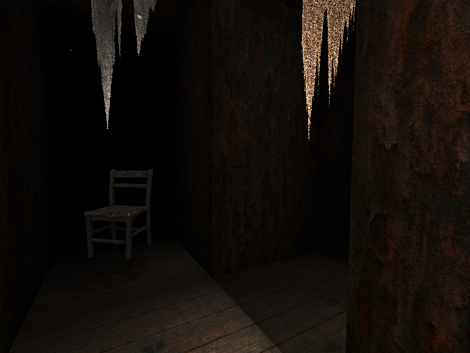

# Dungeon Crawler

A spooky 3D first-person exploration game built with Three.js. Navigate through dark, atmospheric dungeons with only your lantern to light the way. Discover abandoned furniture, dripping water, and decaying environments in this immersive horror-themed experience.

## Features

- **3D Graphics**: Fully rendered 3D dungeon with textured walls, floors, and ceilings
- **Dynamic Lighting**: Player-controlled lantern with realistic shadows and lighting effects
- **Spooky Atmosphere**: 
  - Water droplets falling from ceiling
  - Floating dust particles in the air
  - Tattered cloth banners hanging from above
  - Decay and rot scattered across floors
  - Eerie shadows cast by your lantern
- **Exploration Elements**:
  - Abandoned furniture (chairs with realistic shadows)
  - Multi-floor dungeons with staircases
  - Flashlight that can be toggled on/off for extra suspense
  - Optional pixelation effect for retro horror aesthetic
- **Responsive Controls**:
  - WASD movement
  - Mouse look (click to capture)
  - Fullscreen support (F11)

## Controls

- **Movement**: WASD or Arrow Keys
- **Look**: Mouse (click canvas to capture pointer)
- **Flashlight**: F key to toggle
- **Pixelation**: P key to toggle retro effect
- **Attack**: Space or Enter
- **Fullscreen**: F11 or Alt+Enter

## Technical Details

- Built with Three.js WebGL renderer
- Texture-based rendering with nearest-neighbor filtering for pixel art aesthetic
- Real-time shadow mapping
- Particle systems for environmental effects
- Billboard sprites for furniture and effects

## Assets Required

Place these texture files in the same directory as the HTML file:
- `wall.png` - Wall texture
- `floor.png` - Primary floor texture  
- `floor2.png` - Secondary floor texture (rare)
- `ceiling.png` - Ceiling texture
- `cloth.png` - Hanging cloth texture
- `cloth2.png` - Alternative cloth texture
- `rot.png` - Floor decay decal
- `chair.png` - Chair sprite
- `enemy.png` - Enemy sprite (if used)

## Getting Started

1. Ensure all texture files are in the same directory
2. Open `ascii_dungeon_crawler.html` in a web browser
3. Click the canvas to start playing
4. Use WASD to move and mouse to look around
5. Turn off your flashlight (F key) for maximum spookiness!

Dare to explore the haunted depths of this atmospheric dungeon crawler!